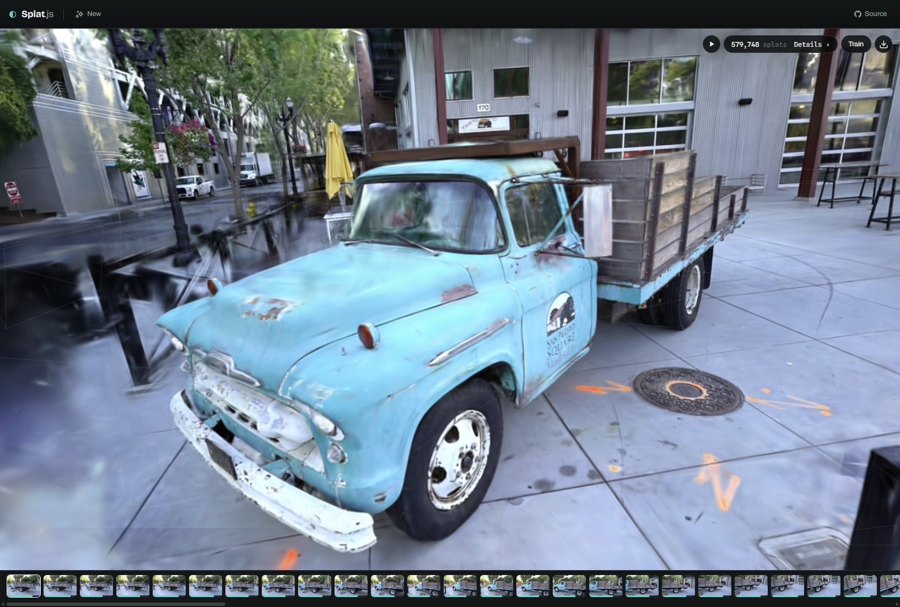

# Splat.js

**Gaussian-splat training that runs entirely in the browser.** Photographs in →
camera poses solved → a 3D Gaussian splat trained against your photos → a
standard `.ply` out. No server, no upload, no account, no build step — the whole
pipeline is vanilla ES modules on WebGPU, running in a tab.


*The Tanks & Temples **Truck** scene — features found, poses solved, and 600,000
Gaussians trained, all live in one Chrome tab.*

- **Structure from motion in JavaScript**: scale-space SIFT (worker pool),
  GPU brute-force matching, incremental registration with interim bundle
  adjustment, sparse Schur BA with shared focal + radial distortion. On the
  full Tanks & Temples *Truck* scene its poses are **pixel-identical to
  COLMAP's** (0.00% of path length, table below).
- **A WebGPU 3DGS trainer**: anisotropic Gaussians, global sorted binning,
  spherical harmonics (degree 2 by default), MCMC-style relocation and growth,
  Mip-Splatting opacity compensation, FD-validated analytic gradients. Scales
  past **1,000,000 splats**.
- **A standard `.ply` export** (INRIA layout, SH included, opacity compensation
  baked) that opens in any splat viewer.

## Try it

Live: **https://arrival.space/splat-js**

Or open a finished result straight away — every trained run can be saved and
shared, and `?model=<url>` (+ `&recon=<url>` for the solved camera path)
loads it back into the viewer, capture-path tour included:

**[The Truck — Tanks & Temples](https://arrival.space/splat-js/index.html?model=https://ugc.arrival.space/splatjs/models/truck_sh3_250k.sog&recon=https://ugc.arrival.space/splatjs/models/truck_sh3_250k_recon.json)**
— the benchmark model from the table below: 251 photographs at native
979 px, 2,000,000 Gaussians, degree-3 spherical harmonics, 250 k cycles:
**26.30 dB on the photographs it never saw** — above 3DGS-MCMC, ~60 min in
one tab.

**[The Bar — a real bar from 76 handheld 360° panoramas](https://arrival.space/splat-js/index.html?model=https://ugc.arrival.space/splatjs/models/bar360_4m_1024.sog&recon=https://ugc.arrival.space/splatjs/models/bar360_4m_1024_recon.json)**
— each panorama sliced into cube faces and solved as one camera rig,
4,000,000 Gaussians trained at 1024 px for 400 k cycles: **27.4 dB against
its training photographs**, ~2.5 h in one tab. (Scene from
[360Roam](https://huajianup.github.io/research/360Roam/), CC BY-NC-SA.)

Or locally:

```
node serve.mjs 8734
# http://localhost:8734/app/
```

Needs a browser with WebGPU — current Chrome, Edge, Firefox and Safari
(iPhones included) all run it, vanilla. It installs as a PWA too: the
browser's install button (or *Add to Home Screen* on iOS) gives the capture
tool its own icon and window — same pipeline, nothing extra. Drop 20–200 overlapping
photos of one place into the app — or capture them straight from the device
camera — or start from a test set (a clone bundles the synthetic set; the
photo sets are served on the hosted demo). Video input exists in the library
(`extractSharpFrames`) but is switched off in the app until the frame
selection is up to the quality bar.

The gear next to **Start training** holds one-knob quality presets — *Draft*
for a fast first look, *Showcase* for a long run at the full 1 M splat budget —
plus the individual knobs (resolution, spherical harmonics, splat budget,
cycles) they drive.

## Measured quality

### Novel-view synthesis, the standard protocol

Append **`?eval`** to the app URL and every 8th photo is held out of training
and scored at the end — photographs the model has never seen, the metric the
research papers report. On the full 251-image Tanks & Temples *Truck* scene at
its native 979 px, on a desktop NVIDIA GPU, in one tab:

| method | Truck test PSNR |
|---|---|
| 3DGS (SIGGRAPH 2023) | 25.18 dB |
| Mip-Splatting (CVPR 2024) | 25.74 dB |
| **Splat.js — 1 M splats, 100 k cycles (~25 min)** | **25.76 dB** |
| Scaffold-GS (CVPR 2024) | 25.77 dB |
| 3DGS-MCMC (NeurIPS 2024) | 26.11 dB |
| **Splat.js — 2 M splats, 250 k cycles (~60 min)** | **26.30 dB** |
| Student Splatting & Scooping (CVPR 2025) | 26.41 dB |

Same images, same resolution, same held-out-every-8th protocol. The published
methods run 2–2.6 M Gaussians with degree-3 spherical harmonics on native
CUDA; Splat.js runs degree 3 too — in a tab. (Benchmark mode pins the native
resolution: on big sets the app otherwise trades resolution for memory, and
PSNR at reduced resolution is not comparable.)

### Camera poses

The solver is measured against COLMAP (and exact ground truth where it
exists). ATE = absolute trajectory error as a fraction of the capture path
length:

| scene | registered | vs reference |
|---|---|---|
| Synthetic (12 rendered views, exact GT) | 12/12 | focal within 0.33% of ground truth |
| Truck (Tanks & Temples, 250 photos) | 250/250 | **0.00% ATE** vs COLMAP (max deviation 0.006%) |
| Camping (handheld video, 113 frames) | 113/113 | 0.23% ATE vs COLMAP |
| Playroom (Deep Blending, 225 DSLR photos) | **207/225** | 0.03% ATE vs COLMAP; 0.13% vs official GT |
| Bicycle (Mip-NeRF 360, 194 photos) | 192/194 | 0.63 px reprojection rms |

Playroom is the interesting row: at the same image resolution, stock COLMAP
3.11 registers only 154–157 of the 225 photos (blank painted walls starve the
features); Splat.js places 207 — and where both place a camera, they agree to
0.03% of the path.

The synthetic, Truck and Camping rows are asserted by the test suite on every
change (`npm test`, `npm run test:quality` — the quality gates drive the
public API in headless Chrome). The remaining rows are measured with the same
tooling (`tests/compare_colmap.mjs`).

## Use the library

Everything a UI needs is one object:

```js
import { createSession } from 'splat.js';

const s = createSession({ maxIters: 40000 });
s.on('stage',   e => { /* { stage, done, total, detail } */ });
s.on('metrics', e => { /* { iter, splats, itersPerSec, psnrTrain, psnrHold } */ });

await s.load(files);      // File/Blob[] -> decoded frames
await s.solve();          // SfM: poses + sparse points (events fire throughout)
await s.seed();           // Gaussians + WebGPU trainer
s.view.attach(canvas);    // render target
s.start();                // training loop (auto-stops, emits metrics)

const ply = await s.exportPlyBlob();
```

Benchmark mode is one option away: `createSession({ evalSplit: 8 })` holds
every 8th frame out of training, and `await s.evalTestPsnr()` returns the
novel-view PSNR (mean + per-frame) after the run.

Or compose the pieces yourself:

```js
import { createGpu, decodeFrames, solve, seed, createTrainer, gaussiansToPly } from 'splat.js';

const gpu     = await createGpu();            // or createGpu({ device }) you own
const frames  = await decodeFrames(files);
const recon   = await solve(frames, { onEvent, signal });   // cancellable
const model   = seed(recon.points);
const trainer = await createTrainer({ gpu });
// ... trainer.setup(...), trainer.stepOnce(), trainer.renderView(pose, ctx)
```

The library reads no globals, touches no DOM (OffscreenCanvas for decoding),
and shares one WebGPU device between the matcher and the trainer — a host that
already owns a device can hand it in.

## Tree

```
src/          the library — no UI, no globals
  index.js    public surface
  session.js  Session: pipeline + training policy + events
  sfm/        SIFT, matching (GPU), geometry, incremental SfM, bundle adjustment
  gs/         WebGPU trainer, WGSL shaders, gradcheck harness
  gpu/        one shared device
  io/         frame decoding, PLY export
app/          the Splat.js app (a Session consumer — the UI never touches internals)
tests/unit/   node tests for the maths (geometry, BA, rotation averaging, SIFT)
tests/quality/ end-to-end accuracy gates in headless Chrome
data/synthetic/ the bundled test set (known ground-truth cameras)
```

The Tanks & Temples / video datasets behind the other quality gates are not
tracked; the gates skip automatically when they are absent.

## License

MIT © Stratum1 GmbH
