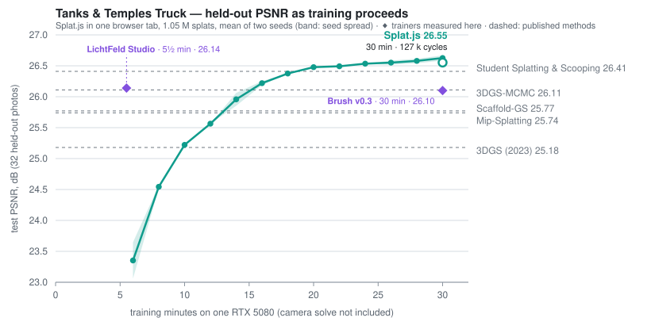

# Splat.js

**Gaussian-splat training that runs entirely in the browser.** Photographs go
in, camera poses come out, a 3D Gaussian splat is trained against the photos,
and a standard `.ply` comes back. No server, no upload, no account, no build
step: the whole pipeline is vanilla ES modules on WebGPU, running in a tab.


*The Tanks & Temples **Truck** scene: features found, poses solved, and
600,000 Gaussians trained, all live in one Chrome tab.*

## What is inside

- **Structure from motion in JavaScript.** Scale-space SIFT on a worker pool,
  GPU brute-force matching, incremental registration with interim bundle
  adjustment, and a sparse Schur bundle adjustment with shared focal and
  radial distortion. On the full Tanks & Temples *Truck* scene the poses are
  pixel-identical to COLMAP's (0.00 % of path length, see below).
- **A WebGPU 3DGS trainer.** Anisotropic Gaussians, global sorted binning,
  spherical harmonics (degree 3 by default), MCMC-style relocation and growth,
  Mip-Splatting opacity compensation, analytic gradients validated by finite
  differences. Scales past 4,000,000 splats.
- **A standard `.ply` export.** INRIA layout, spherical harmonics included,
  opacity compensation baked in, so it opens in any splat viewer.

## Try it

**Live: https://arrival.space/splat-js**

Drop 20 to 200 overlapping photos of one place into the app, or a video, or
capture straight from the device camera, or start from one of the bundled
test sets. The gear next to **Start training** holds one-knob presets
(*Draft* for a fast first look, *Showcase* for a long high-detail run) and the
knobs they drive: resolution, spherical harmonics, splat budget, cycles,
optimizer. The splat budget sizes itself from the cycle budget and the device.

### Finished results

Every trained run can be saved and shared. `?model=<url>` (plus
`&recon=<url>` for the solved camera path) loads a result straight into the
viewer, capture-path tour included.

- **[The Truck — Tanks & Temples](https://arrival.space/splat-js/index.html?model=https://ugc.arrival.space/splatjs/models/truck_1h_v3_2026-09-06.sog&recon=https://ugc.arrival.space/splatjs/models/truck_1h_v3_2026-09-06_recon.json)**
  The benchmark scene from the table below: 251 photographs at native 979 px,
  poses solved in the browser, 1,050,000 Gaussians with degree-3 spherical
  harmonics. Thirty minutes of training reach 26.55 dB on photographs the
  model never saw, above every published Truck number. The linked model is a
  26.65 dB hour-long run of the previous schedule.
- **[The Bar — 102 handheld 360° panoramas](https://arrival.space/splat-js/index.html?model=https://ugc.arrival.space/splatjs/models/bar360_v6_2026-09-08.sog&recon=https://ugc.arrival.space/splatjs/models/bar360_v6_2026-09-08_recon.json)**
  Each panorama is sliced into cube faces and solved as one camera rig
  (588 of 612 faces placed). 3.5 million live Gaussians out of a 4 M budget,
  trained at 912 px for 200 k cycles across both capture walks, 83 minutes in
  one tab. Scene from [360Roam](https://huajianup.github.io/research/360Roam/),
  CC BY-NC-SA.

### Run it locally

```
node serve.mjs 8734
# http://localhost:8734/app/
```

A clone bundles the synthetic test set; the photo sets are served on the
hosted demo.

### Requirements

- A browser with WebGPU: current Chrome, Edge, Firefox and Safari, iPhones
  included, without flags or extensions.
- Optional: install it as a PWA (the browser's install button, or *Add to
  Home Screen* on iOS) to give the capture tool its own icon and window.

## Measured quality

### Novel-view synthesis on Truck

Append `?eval` to the app URL and every 8th photo is held out of training and
scored at the end. Those are photographs the model has never seen, the metric
the research papers report. Everything below is the full 251-image Tanks &
Temples *Truck* scene at its native 979 px, trained on a desktop NVIDIA GPU
(RTX 5080) in one tab.

<p align="center"><picture>
  <source media="(prefers-color-scheme: dark)" srcset="docs/img/truck-psnr-vs-time-dark.svg">
  
</picture></p>

| method | Truck test PSNR |
|---|---|
| 3DGS (SIGGRAPH 2023) | 25.18 dB |
| Mip-Splatting (CVPR 2024) | 25.74 dB |
| Scaffold-GS (CVPR 2024) | 25.77 dB |
| Brush v0.3 — 30 min train · 30 k cycles · 2 M splats (measured here) | 26.10 dB |
| 3DGS-MCMC (NeurIPS 2024) | 26.11 dB |
| LichtFeld Studio v0.5.3 — 5½ min train · 30 k cycles · 2 M splats (measured here) | 26.14 dB |
| **Splat.js — 10 min train · 40 k cycles · 1.4 M splats** | **26.14 dB** |
| Student Splatting & Scooping (CVPR 2025) | 26.41 dB |
| **Splat.js — 30 min train · 127 k cycles · 1.05 M splats** | **26.55 dB** |

How to read the table:

- **Same protocol everywhere.** Same images, same resolution, every 8th
  photo held out. Times are training only; the in-browser camera solve adds
  about 6 minutes on Truck at the desktop defaults (3 with the Quick solve).
- **The chart is one run.** Splat.js trained for thirty minutes and was
  scored on the held-out photos every two minutes (mean of two seeds,
  26.47 / 26.64 dB at the end, 2026-09-09). The 30 min table row is that
  end point. The curve is flat after minute 25; given an hour it lands
  between 26.4 and 26.6.
- **Shorter budgets.** With the schedule set to the budget it reaches
  25.83 dB in 6 minutes (30 k cycles), 26.14 dB in 10 (40 k, the other table
  row) and 26.41 dB in 20 (73 k).
- **Fewer splats win the clock.** A 1.05 M cap fits more cycles into the
  time than 2 M does and scores higher (2 M at 114 k cycles: 26.19 dB).
- **The two "measured here" rows are not paper citations.**
  [LichtFeld Studio](https://github.com/MrNeRF/LichtFeld-Studio) ran on the
  same desktop with its MCMC strategy, 2 M Gaussians and 30 k iterations from
  precomputed COLMAP poses. [Brush](https://github.com/ArthurBrussee/brush)
  ran the same way: same machine, byte-identical images, the same holdout,
  SH degree 3, 2 M splat cap, from the COLMAP poses and sparse cloud. The
  published methods train 30 k iterations of 2 to 2.6 M Gaussians with
  degree-3 spherical harmonics on native CUDA.
- **Splat.js uses its own poses.** They come from the in-browser solve at
  its desktop defaults: 8000 SIFT features from the upsampled first octave
  and a pixel-aspect term in bundle adjustment (the Truck release images are
  0.6 % non-square). That solve takes about 6 minutes instead of 3 and
  trains 0.4 dB higher at 30 k than the Quick solve's poses, because a sharp
  model feels half a pixel. Photos that carry their focal length in EXIF
  (every phone) skip the focal search altogether.
- **Benchmark mode pins the native resolution.** On big sets the app
  otherwise trades resolution for memory, and PSNR at reduced resolution is
  not comparable.

### Camera poses

The solver is measured against COLMAP, and against exact ground truth where
it exists. ATE is the absolute trajectory error as a fraction of the capture
path length.

| scene | registered | vs reference |
|---|---|---|
| Synthetic (12 rendered views, exact GT) | 12/12 | focal within 0.33 % of ground truth |
| Truck (Tanks & Temples, 250 photos) | 250/250 | **0.00 % ATE** vs COLMAP (max deviation 0.006 %) |
| Camping (handheld video, 113 frames) | 113/113 | 0.23 % ATE vs COLMAP |
| Playroom (Deep Blending, 225 DSLR photos) | **207/225** | 0.03 % ATE vs COLMAP; 0.13 % vs official GT |
| Bicycle (Mip-NeRF 360, 194 photos) | 192/194 | 0.63 px reprojection rms |

Playroom is the interesting row. At the same image resolution, stock COLMAP
3.11 registers only 154 to 157 of the 225 photos, because blank painted walls
starve the features. Splat.js places 207, and where both place a camera they
agree to 0.03 % of the path.

## Use the library

Everything a UI needs is one object:

```js
import { createSession } from 'splat.js';

const s = createSession({ maxIters: 40000 });
s.on('stage',   e => { /* { stage, done, total, detail } */ });
s.on('metrics', e => { /* { iter, splats, itersPerSec, psnrTrain, psnrHold } */ });

await s.load(files);      // File/Blob[] -> decoded frames
await s.solve();          // SfM: poses + sparse points (events fire throughout)
await s.seed();           // Gaussians + WebGPU trainer
s.view.attach(canvas);    // render target
s.start();                // training loop (auto-stops, emits metrics)

const ply = await s.exportPlyBlob();
```

Benchmark mode is one option away: `createSession({ evalSplit: 8 })` holds
every 8th frame out of training, and `await s.evalTestPsnr()` returns the
novel-view PSNR (mean and per frame) after the run.

Or compose the pieces yourself:

```js
import { createGpu, decodeFrames, solve, seed, createTrainer, gaussiansToPly } from 'splat.js';

const gpu     = await createGpu();            // or createGpu({ device }) you own
const frames  = await decodeFrames(files);
const recon   = await solve(frames, { onEvent, signal });   // cancellable
const model   = seed(recon.points);
const trainer = await createTrainer({ gpu });
// ... trainer.setup(...), trainer.stepOnce(), trainer.renderView(pose, ctx)
```

The library reads no globals and touches no DOM (OffscreenCanvas for
decoding). It shares one WebGPU device between the matcher and the trainer,
and a host that already owns a device can hand it in.

## Repository layout

```
src/          the library — no UI, no globals
  index.js    public surface
  session.js  Session: pipeline + training policy + events
  sfm/        SIFT, matching (GPU), geometry, incremental SfM, bundle adjustment
  gs/         WebGPU trainer, WGSL shaders, gradcheck harness
  gpu/        one shared device
  io/         frame decoding, video frame selection, PLY export
app/          the Splat.js app (a Session consumer — the UI never touches internals)
tests/unit/   node tests for the maths (geometry, BA, rotation averaging, SIFT)
tests/quality/ end-to-end accuracy gates in headless Chrome
tests/e2e/    Playwright suite for the app's flows (train, pause/resume, restore)
data/synthetic/ the bundled test set (known ground-truth cameras)
```

## Tests

- `npm test` runs the node unit tests.
- `npm run test:quality` drives the public API in headless Chrome and asserts
  the synthetic, Truck and Camping rows of the pose table on every change.
- `npm run test:e2e` runs the Playwright suite against the real app with real
  WebGPU training (a GPU box, not CI).
- The remaining pose rows are measured with the same tooling
  (`tests/compare_colmap.mjs`). The Tanks & Temples and video datasets behind
  the quality gates are not tracked; the gates skip when they are absent.

## License

MIT © Stratum1 GmbH
